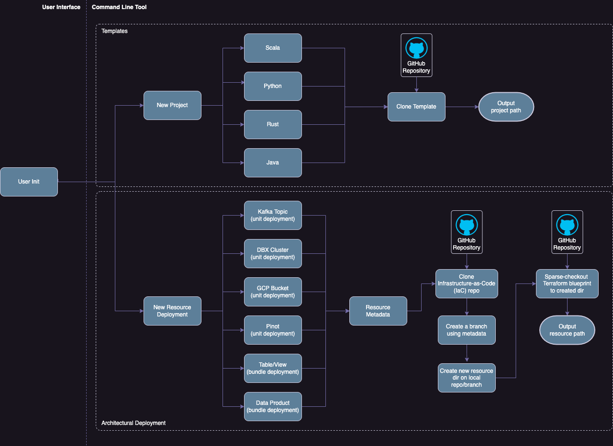

# Rust Command Line Interface Templace

This project creates a generic template for implementing a Rust CLI.
The CLI can then be used to start new projects using standard templates, move files
and directories or even instantiating resources using Terraform blueprints.

